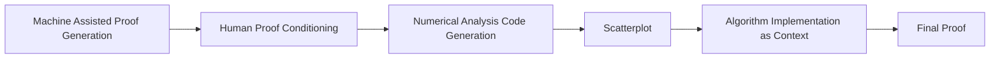

- White Paper Title: Finding Net Credit Utilization Highest Percentage Contributor Choice Algorithm's Proof: Machine Assisted Proof Generation Based Context Engineering

  - Notice on Numerical Analysis: IEEE 754 Floating point number 64-bit, used for scientific compute, but not recommended for any actual implementation of finances due to the well known penny-bug.
    - https://k13n.io/posts/20250412_floats/#:~:text=It%20can%20be%20tempting%20to,why%20that%20is%20the%20case.

- Process of designing and producing proof using a comerically selected MIP ("Gemini 2.5 Pro" and "Gemini Code Assist" 2.52.0-
  2.53.0 was chosen for the purposes of this research):

